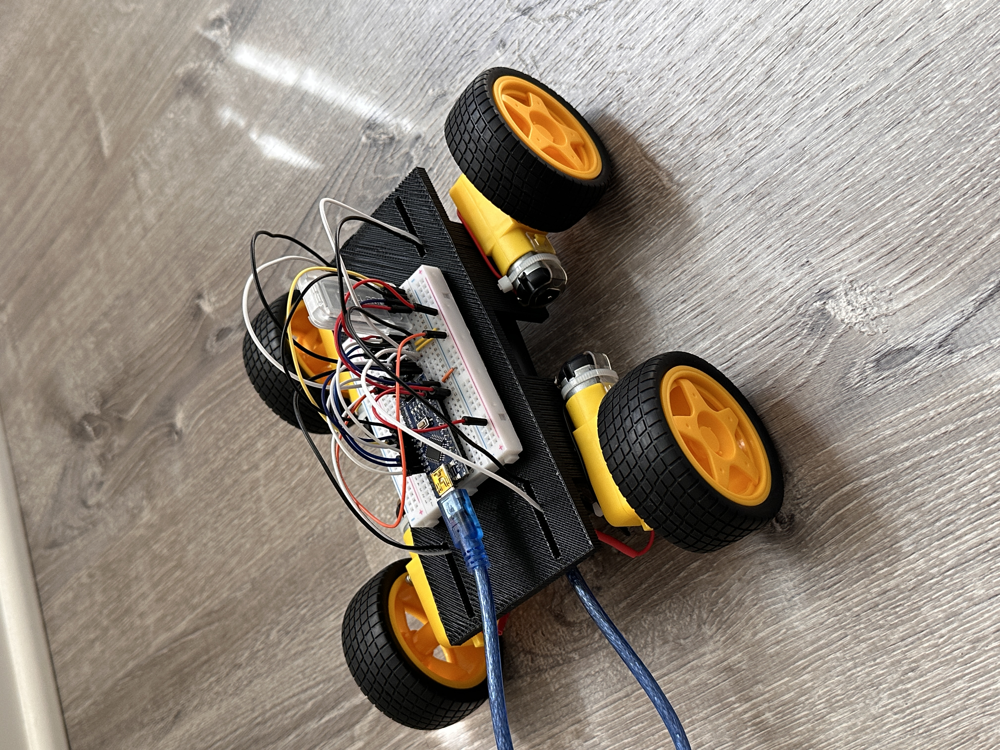
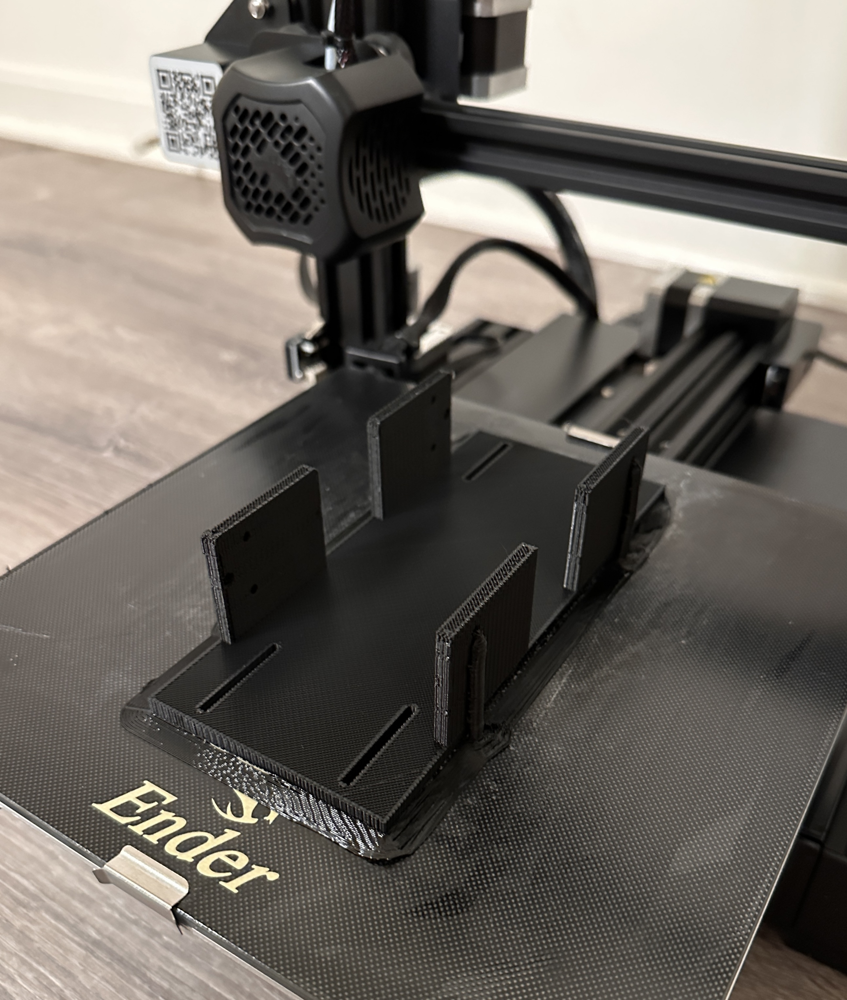
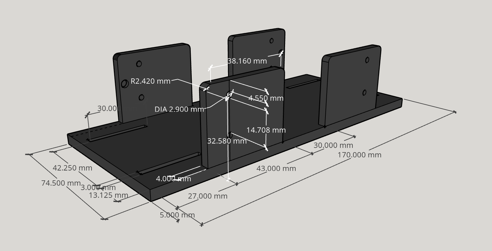

# Car V3.0 

## Description

This is the thrid version of my robot car. I designed and 3d printed a custom chassis. The car is controlled using the Gamepad feature on the Dabble App which is connected to the HM-10 Bluetooth Module on the car. 

## Visuals

